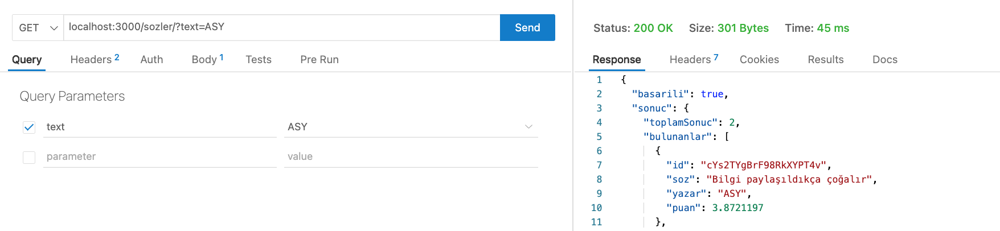
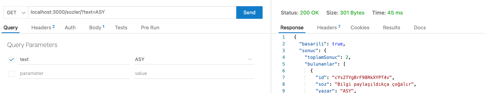
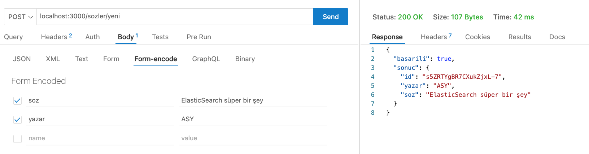

# EleasticSearch NodeJS ile REST API Örneği
Bu örnek [**Fulltext search with Node.js and ElasticSearch on Docker**](https://micheleriva.medium.com/full-text-search-with-node-js-and-elasticsearch-on-docker-edcea23612fd) isimli yazıdan esinlenerek oluşturulmuştur.

## Dosya Yapısı
* veri klasöründe veri oluşturmak ve elasticsearch'e eklemek için gerekli kodlar (index.js) vardır.
* sunucu klasöründe NodeJS uygulamasını çalıştırmak için gerekli kodlar yer almaktadır. index.js uygulamanın başlangıç noktasıdır. REST API için gerekli rotalar routes/index.js dosyasında tanımlanmıştır. Yeni söz ekleme ve söz arama işlemleri models/index.js içinde yapılmaktadır. controllers/index.js, modeli kullanarak sonuçları JSON formatında ekrana basmaktadır.
* elastic.js dosyasında indeks, mapping oluşturma ve bağlantı kodları yer almaktadır.
* main.js dosyasında elasticsearch'e bağlanma, index ve mapping oluşturma işlemleri yapılmaktadır.

## Çalıştırma
* `docker build -t node .` komutu ile node imajını oluşturun
* `docker-compose up` komutu ile elasticsearch ve nodejs kapsayıcılarını aktif hale getirin.

## Örnek
* [localhost:3000/sozler/?text=ASY](localhost:3000/sozler/?text=ASY) GET isteği ile arama yapılabilir. Arama için hem söz hem de yazar ismi girilebilir.

* [localhost:3000/sozler/yeni](localhost:3000/sozler/?text=ASY) POST isteği ile yeni veri eklenebilir.

